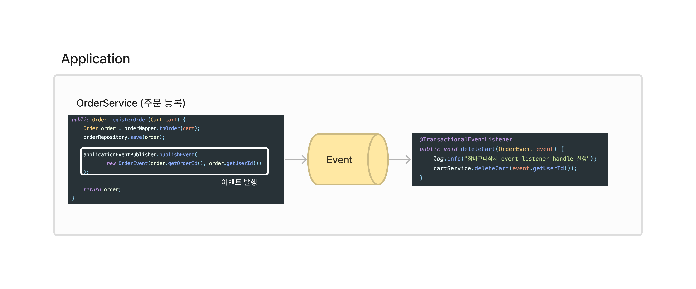

# Spring Event

## '주문처리' 과 '장바구니삭제' 강결합 해결해보기
- ApplicationEvent 로 이벤트 발행 및 구독
  - ApplicationEventPublisher 이벤트 발행 : [코드](src/main/java/com/study/springevent/order/service/OrderService.java)
  - 구독(listen)
    1. ApplicationListener 를 구현, onApplicationEvent 를 오버라이딩 하여 이벤트 구독 : [코드](src/main/java/com/study/springevent/cart/domain/DeleteCartWithOrderEventListener.java)
    2. `@EventListener` 어노테이션으로 이벤트 구독 : [코드](src/main/java/com/study/springevent/cart/domain/DeleteCartWithOrderEventHandler.java)
      - @EventListener 는 이벤트가 발행된 직후 이벤트가 실행된다. (트랜잭션 문제 가능성 있음.)
      - 트랜잭션과 무관하게 실행해도 되는 이벤트라면 적절할 수 있다. (이벤트 발행 후 트랜잭션이 rollback되는 상황까지 고려해야함.)
      - `@TransactionalEventListener` 어노테이션을 활용하면 발행 트랜잭션이 commit 된 이후에 실행된다.
- 참고
  - backtony 님의 [Spring - Event Driven](https://velog.io/@backtony/Spring-Event-Driven)
  - cheese10yun 님의 [ApplicationEventPublisher 기반으로 강결합 및 트랜잭션 문제 해결](https://cheese10yun.github.io/event-transaction/)

## Spring Event 구독과 발행, 테스트할 수 있을까?

기본적으로 이벤트 발행은 `ApplicationContext` 내에서 돌기 때문에 @SpringBootTest 어노테이션을 통해 테스트를 진행해야 한다고 생각했다.  
`ApplicationEventPublisher` 의존성을 추가하여 이벤트를 발행할 거다.

이벤트 발행되고 구독되는 행위는 전적으로 ApplicationContext가 해주는 범위고 사실상 99.99% 정상적으로 동작한다고 보장할 수 있다.    
문제는 이 ApplicationContext가 제공해주는 기능을 개발자가 온전히 이해하고 정확하게 개발하고 있다고 보장할 수 없다.  

실제로 겪은 문제로는 @TransactionalEventListener 로 트랜잭션의 시점 기준으로 이벤트가 발행되도록 하고싶었는데 실제 어플리케이션에서 정상적으로 동작하지 않은 경험이 있다.  
원인은 이벤트를 발행하는 곳에서 @Transactional을 선헌하지 않았기 때문에 발생한 이유였는데 사실 테스트를 수행해서 정상적으로 동작하지 않는다는 것을 확인했다면 실제 동작, 혹은 배포 후에나 확인하는 불상하는 없었을 수 있다.  
때문에 ApplicationConext의 기능을 테스트 한다기 보단 **기능을 정확하게 활용하고 있는지 테스트**한다고 볼 수 있다.   

그럼 무엇을 테스트해야하는가?



위의 그림의 어플리케이션에서 내가 테스트하고싶은 것은 무엇인지 고민해보자.

가장 먼저 OrderService의 registerOrder(..)의 로직을 테스트 해볼 수 있어 보인다.
그리고 핸들러인 deleteCart(..) 의 로직을 테스트하면 되겠다.  
하지만, 이 두 가지는 Spring Event가 발행-구독을 정상적으로 동작하도록 구현한 것인지는 테스트 하는 것이 아니다.

내가 테스트하려는 발행-구독을 테스트 하기 위해선 ApplicationEventPublisher로 발행하고 @TransactionalEventListener(@EventListener)로 구독하는지 테스트 하면 된다.
ApplicationContext가 제공하는 기능으로 기대하는 대로 동작하는지 확인해보면 된다.

### 발행 테스트, 구독 테스트 나눠보기

여러번 고민하다가.. 핸들러(=리스너)는 사실 **어노테이션+이벤트 조합으로 구성되어있으면 무조건 구독한다고 가정하면 된다.**  
그래서 실제 핸들러와 유사한 테스트핸들러 Bean을 만들었고, 해당 Bean이 상태를 가지도록 구현했다.

> <실제 핸들러로 테스트 하지 않은 이유>
> 실제 핸들러가 상태를 가지거나, 테스트를 위해 코드를 작성하는 것을 방지하고 핸들러 원본 코드는 건들지 않으면서 테스트 하는 것이 좋다고 판단했기 때문이다.
> 핸들러와 구성이 같은 테스트 핸들러로 테스트를 한다면 1차적인 테스트는 할 수 있다고 판단했다.

테스트 핸들러는 다음과 같다.

```java

@Component
class TestOrderEventHandler {
    private final AtomicBoolean eventHandled; // 이벤트가 발행되면 상태가 바뀐다.

    public TestOrderEventHandler() {
        this.eventHandled = new AtomicBoolean(false);
    }

    @EventListener
    public void handleOrderEvent(PayloadApplicationEvent<OrderEvent> event) {
        eventHandled.set(true);
    }

    public boolean isSubscript() {
        return eventHandled.get();
    }
}

```

무엇을 테스트 하려는가? 이벤트 발행에 따른 정상적으로 구독이 작동하는지 테스트 하려는 것이다.  
핸들러 내부에 어떤 코드가 있는지, 그 코드가 제대로 작동하는지 테스트 하려는 것이 아니다.  
온전히 **Spring Event**가 발행,구독이 정상적인지 테스트 하려는 것이다!  

최종 테스트 코드는 다음과 같다.

```java
// 이벤트 객체 (Object 타입으로 발행한다. ApplicationEvent 상속받지 않음.)
public class OrderEvent {
    private Long orderId;
    private String userId;

    public OrderEvent(Long orderId, String userId) {
        this.orderId = orderId;
        this.userId = userId;
    }

    public Long getOrderId() {
        return orderId;
    }

    public String getUserId() {
        return userId;
    }
}

```

```java
import com.study.springevent.domain.order.domain.OrderEvent;
import org.junit.jupiter.api.Test;
import org.springframework.beans.factory.annotation.Autowired;
import org.springframework.boot.test.context.SpringBootTest;
import org.springframework.context.ApplicationEventPublisher;
import org.springframework.context.PayloadApplicationEvent;
import org.springframework.context.event.EventListener;
import org.springframework.stereotype.Component;
import org.springframework.test.context.ActiveProfiles;

import java.util.concurrent.atomic.AtomicBoolean;

import static org.assertj.core.api.Assertions.assertThat;

@SpringBootTest
@ActiveProfiles("test")
public class EventPublishTest {
    @Autowired
    private ApplicationEventPublisher eventPublisher;

    @Autowired
    private TestOrderEventHandler orderEventHandler;

    @Test
    public void testSampleEventPublishing() {
        // Given
        OrderEvent event = new OrderEvent(1L, "userId");

        // When
        eventPublisher.publishEvent(event);

        // Then
        assertThat(orderEventHandler.isSubscript()).isTrue();
    }

}

```

깔꼬롬 하다~


### 위 방법의 문제점

실제 프로젝트에서는 로직을 수행하는 event handler가 있고 @SpringBootTest 로 테스트를 실행하면 이 실제 event handler가 구독을 하게 된다.  
그럼 테스트를 완전히 분리하고 싶었지만 실제로는 커다란 하나의 테스트 환경에서 실행이 된다.  
발행만 테스트 하려다가 구독의 로직을 모두 모킹해야 된다거나 테스트의 복잡도가 높아진다.  
실제 실무에서 이 방법을 사용하려다가 너무 복잡한 구조에 골머리를 썩었다..

### 공식적으로 지원하는 Spring Test

> https://docs.spring.io/spring-framework/reference/testing/testcontext-framework/application-events.html

열심히 고민해봤던게 민망할정도로 테스트를 제공해주고 있었다.
